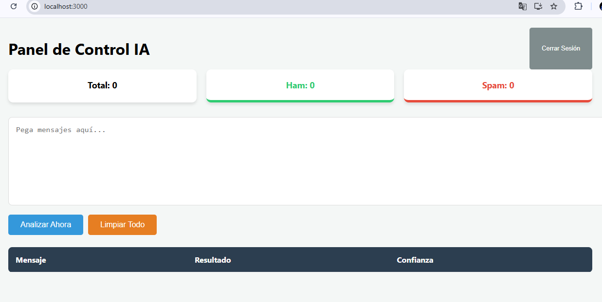
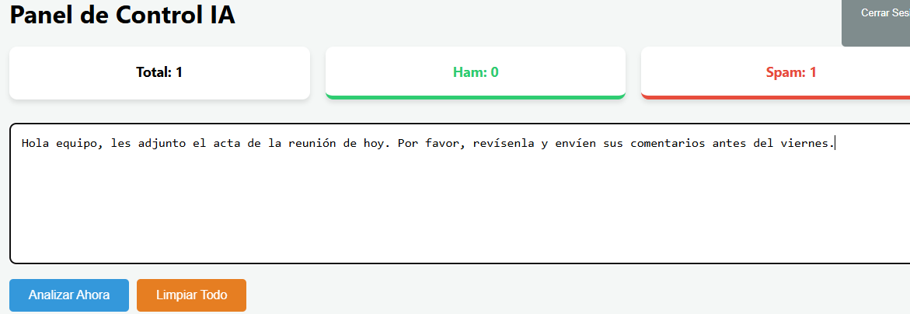
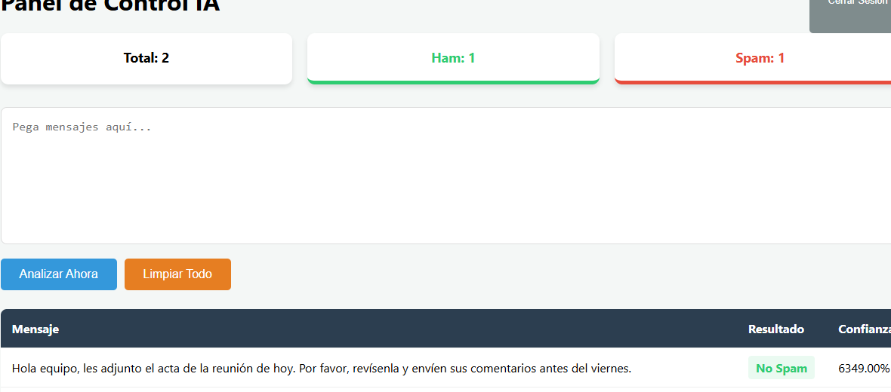
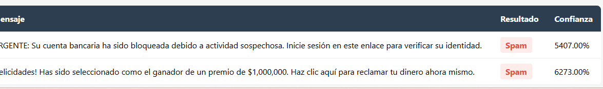

# MANUAL DE USUARIO: SISTEMA CLASIFICADOR DE SPAM

Este manual ha sido diseñado para guiar al usuario en el uso de la plataforma de detección inteligente de mensajes. El sistema permite analizar textos de forma instantánea para identificar posibles riesgos o publicidad no deseada.

## BIENVENIDA AL SISTEMA
La plataforma utiliza tecnología avanzada para analizar el lenguaje y ayudarle a decidir si un mensaje es seguro o si debe ser tratado con precaución. El objetivo principal es ofrecerle una herramienta de apoyo en la gestión de su información diaria.

## INICIO DE LA APLICACIÓN
Para comenzar a utilizar la herramienta, simplemente acceda a la dirección web proporcionada. Verá una pantalla limpia con un espacio central diseñado para la interacción directa.

## COMPONENTES PRINCIPALES DE LA PÁGINA
La interfaz es sumamente sencilla y consta de los siguientes elementos visuales:

* **Caja de texto:** Es el lugar donde usted debe colocar el mensaje que desea revisar.
* **Botón Analizar:** Es el mando que inicia el proceso de revisión inteligente.
* **Panel de Resultado:** Es el recuadro que le indicará la categoría del mensaje una vez terminado el proceso.

## INSTRUCCIONES DE USO PASO A PASO

### PASO 1: PREPARACIÓN DEL MENSAJE
Busque el mensaje o correo electrónico que le genera dudas. Copie el texto principal del mensaje. No es necesario copiar el nombre del remitente ni la fecha, solo el contenido del mensaje.

### PASO 2: INGRESO Y ANÁLISIS
Diríjase a la plataforma y pegue el texto dentro del recuadro blanco central. Una vez que el texto esté allí, haga clic en el botón **Analizar**. Notará que el sistema procesa la información en menos de un segundo.

### PASO 3: LECTURA DEL RESULTADO
El sistema le mostrará un veredicto basado en los patrones encontrados en el texto.

* **Mensaje Legítimo (Ham):**
    Si el resultado indica que el mensaje es Ham o Legítimo, significa que no se han encontrado elementos sospechosos y el correo parece ser una comunicación normal.

* **Mensaje de Spam:**
    Si el resultado indica que el mensaje es Spam, el sistema ha detectado que el texto tiene características típicas de publicidad masiva, estafas o contenido no solicitado. Se recomienda tener precaución con este tipo de mensajes.

## CONSEJOS PARA OBTENER MEJORES RESULTADOS
Para que el sistema sea lo más preciso posible, tenga en cuenta las siguientes recomendaciones:

1.  **Longitud del mensaje:** El sistema funciona mejor con oraciones completas. Si solo pone una palabra, el análisis podría no tener suficiente información.
2.  **Claridad del texto:** Evite pegar códigos extraños o muchos números sin sentido, ya que esto puede confundir la interpretación del sistema.
3.  **Privacidad:** El análisis se realiza al momento. Su texto es procesado para darle una respuesta y no se queda guardado para otros fines.